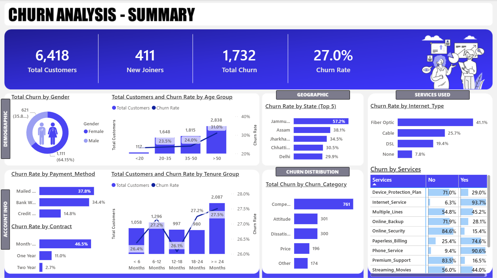
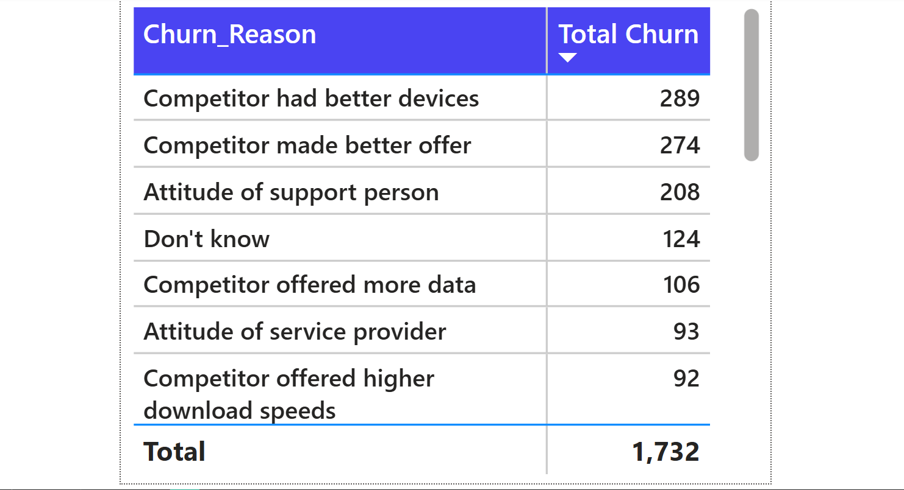

# 📡 **Telecom Customer Churn Analysis (SQL + Power BI)**

## 📊 **Project Overview**

This project is an interactive **Telecom Customer Churn Analysis Dashboard** built using **SQL Server and Power BI**. It analyzes customer data to uncover patterns, behaviors, and key drivers behind customer churn.

**Aim** : Transform raw telecom data into clear, actionable insights to help businesses reduce churn and improve customer retention.

---

## 🎯 **Objectives**

- Analyze overall customer churn rate

- Identify high-risk customer segments

- Evaluate churn based on contract type, tenure, and services

- Understand the impact of demographics (age, gender)

- Identify top reasons for customer churn

- Provide insights to support data-driven decision making

Every visual is designed to deliver **quick, clear, and business-focused insights.**

---

## ✨ **Key Features**

- End-to-end project **(SQL + Power BI)**

- KPI-focused analysis (Total Customers, Churn Rate, etc.)

- Tooltip page for detailed churn reasons (advanced feature ⭐)

- Clean and structured UI design

- Combination of charts, KPIs, and tables

- Insight-driven visualizations

---

## 📁 **Dataset**

Dataset: `Customer_Data.csv`

---

## 📷 **Dashboard Preview**

### 🏠 **Summary Page**

### 📉 **Churn Reason Analysis (Tooltip Page)**

---

## 🛠 **Tools & Skills**

| Tool / Concept | Use                   |
| -------------- | --------------------- |
| SQL Server     | Database & ETL        |
| SSMS           | Query execution       |
| Power BI       | Dashboard development |
| Power Query    | Data transformation   |
| DAX            | KPI calculations      |
| CSV Dataset    | Source data           |

---

## 📂 **Repository Contents**

- `Churn Analysis.pbix` — Power BI dashboard

- `Customer_Data.csv` — Dataset

- `README.md` — Project Documentation

- `Business_Requirements.docx` — Project brief

- `SQL_Scripts.sql` — ETL & transformation queries

- `Dashboard_Screenshots` — Dashboard images

---

## 🚀 **How To View**

1️⃣ Download the `.pbix` file

2️⃣ Open in Power BI Desktop

3️⃣ Use filters and visuals to explore insights

---

## 💡 **Key Insights**

- Customers with **month-to-month contracts** have the highest churn rate

- **Fiber optic users** show significantly higher churn

- Both **new customers (< 6 months) and long-tenure customers (≥ 24 months)** show high churn rates.

- Top churn reasons include:
   - Competitor better offers
   - Better devices
   - Poor customer support

- **Paperless billing users** have higher churn tendency

---

## 🔮 **Future Improvements**

- Automate ETL pipeline

- Deploy dashboard to Power BI Service

- Add more advanced DAX calculations

---

## 👩‍💻 **Author**

**Siddhi Satpute**